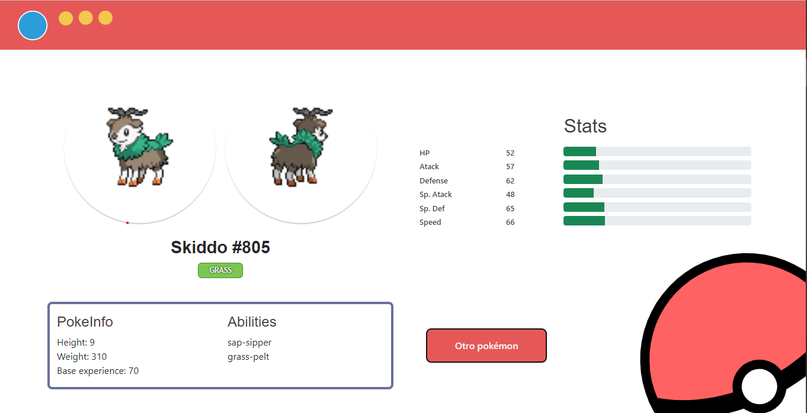

# Pokédex

Prueba técnica con el objetivo de mostrar mis habilidades en el desarrollo frontend.

Es una página que consulta un Pokémon de manera aleatoria, al entrar por primera vez y mediante el botón de consulta a la api [pokeapi](https://pokeapi.co/). Y consulta otro pokémon cada 30s, siendo guardados en un historial.

Es una página responsiva, y con la característica plus de cambiar de diseño mediante el tamaño de pantalla.

[Link al sitio](https://stately-chebakia-eaa744.netlify.app/)

## Inspiraciones de los diseños

- Desktop: Basada en la pokédex original.
- Mobile: Basada en la pokédex de sexta generación.

## Tecnologías usadas

- React
- Sass
- Bootstrap
- EDgrid
- Svg (Los svg utilizados fueron creados por mí)

## Versión Mobile

## Versión Desktop

