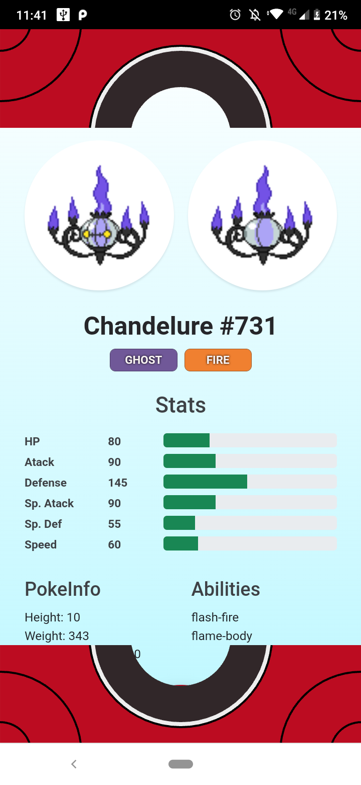

# Pokédex

Prueba técnica con el objetivo de mostrar mis habilidades en el desarrollo frontend.

Es una página que consulta un pokémon de manera aleatoria, al entrar por primera vez y mediante el botón de consulta.

Es una página responsiva, y con la caraácteritica plus de cambiar de diseño mediante el tamaño de pantalla.

- Desktop: Pókedex original.
- Mobile: Pokedex de sexta generación.

